# Multimodal RAG on AWS (Bedrock + Nova)

A **production-style multimodal Retrieval-Augmented Generation (RAG)** system built entirely on **AWS**.  
This system ingests PDFs containing **text, images, and tables**, embeds them using **AWS Titan**, retrieves relevant context via **FAISS**, and generates **grounded multimodal answers** using **Amazon Nova** through **AWS Bedrock**.

---

## ✨ Key Highlights

- 📄 Multimodal PDF ingestion (text, images, tables)  
- 🧠 Pure RAG architecture (no agents, deterministic retrieval)  
- 🧩 Modality-aware chunking and indexing  
- 🔍 FAISS-powered similarity search  
- 🤖 Multimodal prompting with Amazon Nova  
- ☁️ Built entirely on AWS Bedrock–compatible components  

---

## 🧱 System Architecture

The architecture is split into two clear stages: **Indexing** and **Query & Generation**, making the end-to-end flow easy to reason about and debug.

```mermaid
flowchart LR

%% =======================
%% Indexing Pipeline
%% =======================
subgraph Indexing["📦 Indexing Pipeline"]
    A[PDF Documents] --> B[Multimodal Ingestion]

    B --> T[Text Extraction]
    B --> I[Image Extraction]
    B --> Tb[Table Extraction]

    T --> C[Chunking & Normalization]
    I --> C
    Tb --> C

    C --> E[Embeddings<br/>AWS Titan]
    E --> V[FAISS Vector Store]
end

%% =======================
%% Query Pipeline
%% =======================
subgraph Query["🔎 Query & Generation Pipeline"]

    Q[User Query] --> R[Similarity Retrieval]
    R --> P[Multimodal Prompt Assembly]
    P --> N[Amazon Nova]
    N --> O[Final Answer]
end

%% =======================

```

---
🧠 Architecture Walkthrough
1. Multimodal Ingestion

PDF documents are parsed using best-in-class tools tailored to each modality:

-Text → LangChain PDF loaders

-Images → PyMuPDF

-Tables → Tabula

Each modality is extracted independently to preserve semantic structure and reduce cross-modality noise.

2. Chunking & Embeddings

All extracted content undergoes the following steps:

-Normalization

-Recursive chunking (with overlap where necessary)

-Embedding via AWS Titan Embeddings

This design ensures high-quality semantic retrieval across textual, visual, and tabular content.

3. Vector Storage & Retrieval

-Embeddings are stored in a FAISS vector database

-User queries are embedded and used for similarity search

-The most relevant multimodal chunks are retrieved for generation

FAISS enables fast, local retrieval with minimal overhead.

4. Multimodal Generation

-Retrieved chunks are assembled into a multimodal prompt

-The prompt is passed to Amazon Nova via AWS Bedrock

-Nova reasons over text + visual context to generate grounded answers

This approach minimizes hallucinations while preserving rich contextual understanding.

---

🚀 Features

-Multimodal PDF ingestion (text, tables, images)

-Recursive text chunking with overlap

-FAISS-based vector similarity search

-Amazon Bedrock Nova integration

-Vision + text grounded generation

-Robust handling of noisy, real-world PDFs

---

📌 Design Choices

-RAG-only (no agents)

-Predictable behavior

-Easier debugging and evaluation

-FAISS (local vector store)

-Fast iteration cycles

-Lower cost compared to managed vector DBs

-Modality-aware ingestion

-Better grounding

-Reduced hallucinations

-Improved retrieval quality

---
